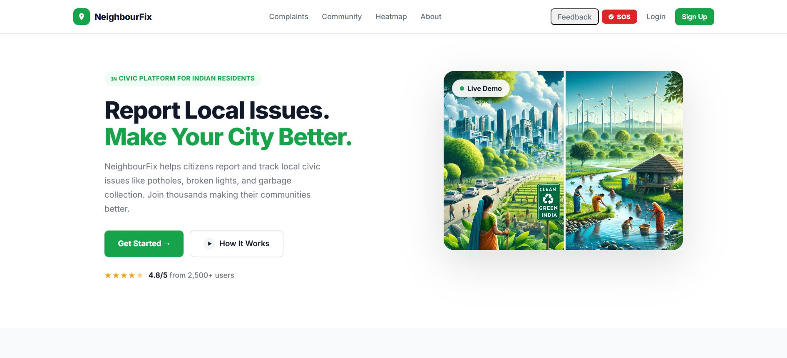

<div align="center">



# 🏘️ NeighbourFix

**Hyperlocal Civic Complaint & Resolution Tracker for Indian Residents**

[](https://neighbour-fix.vercel.app/)
[](https://nodejs.org/)
[](https://react.dev/)
[](https://mongodb.com/)
[](#license)

> ⚠️ **Note:** The backend runs on a free-tier server and may take **30–60 seconds to wake up** on the first request. If the demo appears blank, please wait a moment and refresh.

</div>

---

## 📋 Table of Contents

- [Overview](#-overview)
- [Features](#-features)
- [Tech Stack](#-tech-stack)
- [Getting Started](#-getting-started)
- [Environment Variables](#-environment-variables)
- [API Reference](#-api-reference)
- [Project Structure](#-project-structure)
- [User Roles](#-user-roles)
- [Deployment](#-deployment)
- [Known Issues & Roadmap](#-known-issues--roadmap)
- [License](#-license)

---

## 🌍 Overview

**NeighbourFix** is a full-stack MERN civic issue reporting platform built for Indian urban residents. It bridges the gap between citizens and local ward authorities by enabling transparent, traceable complaint management.

Residents can report issues like potholes, broken streetlights, garbage pile-ups, and drainage failures — with location tagging, image evidence, and community upvoting. Ward admins get a dashboard to triage, update status, and close complaints. High-impact issues automatically escalate to authorities via email.

---

## ✨ Features

| Feature | Description |
|---|---|
| 📍 **Geo-tagged Complaints** | Submit issues with precise location, category, description, and photo evidence |
| 🗺️ **Interactive Map View** | Browse complaints on a Leaflet map with real-time status overlays |
| 🔥 **Public Heatmap** | Visualize complaint density across wards at a glance |
| 🔐 **JWT Authentication** | Secure resident registration and login with token-based auth |
| 🛠️ **Ward Admin Dashboard** | Admins can manage, update status, and resolve complaints in bulk |
| 👍 **Upvote & Auto-Escalation** | Complaints with 10+ upvotes automatically trigger email escalation |
| 📄 **PDF Generation** | Generate printable complaint reports for offline filing |
| 📧 **Email Escalation** | Notify ward officers via Nodemailer when issues cross the upvote threshold |
| 🔔 **Real-time Notifications** | Socket.io-powered live updates on complaint status changes |
| 📱 **Responsive UI** | Fully mobile-friendly React frontend built with Vite |

---

## 🛠️ Tech Stack

### Frontend
| Technology | Purpose |
|---|---|
| React 18 + Vite | UI framework and build tooling |
| React Router v6 | Client-side routing |
| Leaflet.js | Interactive maps and heatmap |
| Axios | HTTP client with interceptors |
| Socket.io Client | Real-time status notifications |

### Backend
| Technology | Purpose |
|---|---|
| Node.js + Express | REST API server |
| MongoDB + Mongoose | Database and ODM |
| JSON Web Tokens (JWT) | Authentication and authorization |
| Multer | Multipart file/image uploads |
| PDFKit | Complaint PDF generation |
| Nodemailer | Email escalation notifications |
| Socket.io | WebSocket server for real-time events |

---

## 🚀 Getting Started

### Prerequisites

- Node.js `v18+`
- npm `v9+`
- A running [MongoDB Atlas](https://www.mongodb.com/atlas) cluster (or local MongoDB instance)

### 1. Clone the repository

```bash
git clone https://github.com/your-username/neighbourfix.git
cd neighbourfix
```

### 2. Install dependencies

```bash
# Install backend dependencies
cd backend && npm install

# Install frontend dependencies
cd ../frontend && npm install
```

### 3. Configure environment variables

See the [Environment Variables](#-environment-variables) section below.

### 4. Run in development mode

Open **two terminals**:

```bash
# Terminal 1 — Backend
cd backend
npm run dev
# → API running at http://localhost:3001
```

```bash
# Terminal 2 — Frontend
cd frontend
npm run dev
# → App running at http://localhost:5000
```

---

## 🔑 Environment Variables

Create a `.env` file inside the `backend/` directory:

```env
# ── Required ──────────────────────────────────────────────
MONGODB_URI=mongodb+srv://<user>:<password>@cluster.mongodb.net/neighbourfix
JWT_SECRET=your_super_secret_jwt_key
PORT=3001
NODE_ENV=development

# ── Optional (Email Escalation) ───────────────────────────
EMAIL_USER=your_smtp_email@gmail.com
EMAIL_PASS=your_smtp_app_password
WARD_OFFICER_EMAILS=officer1@example.com,officer2@example.com
```

Create a `.env` file inside the `frontend/` directory:

```env
# ── Required ──────────────────────────────────────────────
VITE_API_URL=http://localhost:3001
```

> 💡 In production, set `VITE_API_URL` to your deployed backend URL (e.g., `https://neighbourfix-api.onrender.com`) via your hosting provider's environment variable settings.

---

## 📡 API Reference

### Authentication

| Method | Endpoint | Description | Auth Required |
|---|---|---|---|
| `POST` | `/api/auth/register` | Register a new resident account | ❌ |
| `POST` | `/api/auth/login` | Login and receive a JWT | ❌ |
| `GET` | `/api/auth/me` | Get current logged-in user profile | ✅ |
| `PUT` | `/api/auth/profile` | Update user profile details | ✅ |

### Complaints

| Method | Endpoint | Description | Auth Required |
|---|---|---|---|
| `POST` | `/api/complaints` | Create a new complaint (supports image upload) | ✅ |
| `GET` | `/api/complaints` | List complaints with optional filters | ❌ |
| `GET` | `/api/complaints/nearby` | Fetch complaints near a lat/lng coordinate | ❌ |
| `GET` | `/api/complaints/heatmap` | Heatmap data and status statistics | ❌ |
| `GET` | `/api/complaints/:id` | Get full detail for a single complaint | ❌ |
| `POST` | `/api/complaints/:id/upvote` | Upvote a complaint | ✅ |
| `PUT` | `/api/complaints/:id/status` | Update complaint status | ✅ Ward Admin |
| `POST` | `/api/complaints/:id/resolve` | Mark a complaint as resolved | ✅ Ward Admin |

---

## 📁 Project Structure

```
neighbourfix/
├── frontend/
│   ├── package.json
│   ├── vite.config.js
│   └── src/
│       ├── App.jsx
│       ├── main.jsx
│       ├── index.css
│       ├── api/
│       │   └── axios.js          # Axios instance with base URL + interceptors
│       ├── components/           # Reusable UI components
│       ├── context/              # React context (auth, complaints)
│       └── pages/                # Route-level page components
│
└── backend/
    ├── package.json
    ├── app.js                    # Express app setup
    ├── server.js                 # Entry point + Socket.io init
    ├── config/
    │   └── db.js                 # MongoDB connection
    ├── routes/                   # Express route definitions
    ├── controllers/              # Route handler logic
    ├── models/                   # Mongoose schemas
    ├── middleware/               # Auth guards, error handlers
    ├── utils/                    # PDF generation, email helpers
    └── uploads/                  # Runtime image storage (gitignored)
```

---

## 👥 User Roles

### `resident`
- Register and log in to the platform
- Submit complaints with location, category, description, and photos
- Upvote existing complaints to amplify impact
- Track the status of submitted complaints in real time

### `ward_admin`
- Access a dedicated admin dashboard
- Update complaint statuses (e.g., *Pending → In Progress → Resolved*)
- Resolve and close complaints with notes
- View ward-level analytics and complaint summaries

---

## 🌐 Deployment

### Frontend (Vercel)

1. Connect your GitHub repo to [Vercel](https://vercel.com)
2. Set the **root directory** to `frontend/`
3. Add environment variable: `VITE_API_URL=https://your-backend-url.com`
4. Add a `vercel.json` in the `frontend/` root for SPA routing:

```json
{
  "rewrites": [{ "source": "/(.*)", "destination": "/index.html" }]
}
```

### Backend (Render / Railway)

**Recommended free-tier options:**
- [Render.com](https://render.com) — deploy as a Web Service, add env vars, auto-deploy on push
- [Railway.app](https://railway.app) — supports MongoDB add-on out of the box

Set all required environment variables from the [Environment Variables](#-environment-variables) section in your hosting provider's dashboard.

### Self-hosted (Production Build)

Build and serve the frontend from the backend:

```bash
cd frontend
npm run build
cp -r dist ../backend/public

cd ../backend
npm start
# Serves React app + API on $PORT
```

---

## 🐛 Known Issues & Roadmap

### Known Issues
- [ ] Backend cold starts on free-tier hosting (~30–60s delay on first request)
- [ ] Image uploads are stored on the server filesystem (not persistent on Render free tier — migrate to Cloudinary or S3 for production)

### Roadmap
- [ ] Cloudinary integration for persistent image storage
- [ ] Push notifications via Firebase Cloud Messaging
- [ ] Hindi language support (i18n)
- [ ] Ward boundary GeoJSON overlays on the map
- [ ] Admin analytics dashboard with chart visualizations

---

## 📄 License

This repository is provided **as-is** for demo and development purposes. Not licensed for commercial use.

---

<div align="center">

Made with ❤️ for Indian civic communities

</div>
